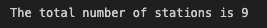
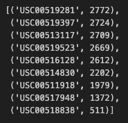
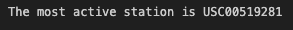
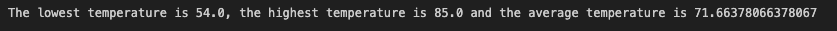
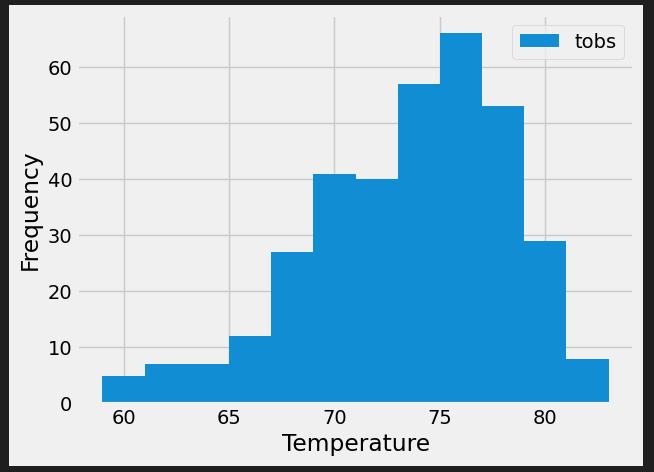

# sqlalchemy-challenge

Congratulations! You've decided to treat yourself to a long holiday vacation in Honolulu, Hawaii. To help with your trip planning, you decide to do a climate analysis about the area. The following sections outline the steps that you need to take to accomplish this task.

## Part 1: Analyze and Explore the Climate Data

### Precipitation Analysis

- Most recent date in the dataset.

- Date one year before the most recent date in data set.

- Pandas DataFrame with last 12 months of precipitation data.

- Chart showing last 12 months of precipiation data.

- Summary statistics for the last 12 months of precipitation data.

### Station Analysis

- Total number of stations in the dataset.

- Design a query to find the most-active stations.

- Which station id has the greatest number of observations?

- Design a query that calculates the lowest, highest, and average temperatures that filters on the most-active station id found in the previous query.

- Design a query to get the last 12 months of temperature observations (TOBS) for the most active station and plot a histogram with its results.

## Part 2: Design Your Climate App

Now that you’ve completed your initial analysis, you’ll design a Flask API based on the queries that you just developed. To do so, use Flask to create your routes as follows:

    /

        Start at the homepage.

        List all the available routes.

    /api/v1.0/precipitation

        Convert the query results from your precipitation analysis (i.e. retrieve only the last 12 months of data) to a dictionary using date as the key and prcp as the value.

        Return the JSON representation of your dictionary.

    /api/v1.0/stations
        Return a JSON list of stations from the dataset.

    /api/v1.0/tobs

        Query the dates and temperature observations of the most-active station for the previous year of data.

        Return a JSON list of temperature observations for the previous year.

    /api/v1.0/<start> and /api/v1.0/<start>/<end>

        Return a JSON list of the minimum temperature, the average temperature, and the maximum temperature for a specified start or start-end range.

        For a specified start, calculate TMIN, TAVG, and TMAX for all the dates greater than or equal to the start date.

        For a specified start date and end date, calculate TMIN, TAVG, and TMAX for the dates from the start date to the end date, inclusive.

Hints

    Join the station and measurement tables for some of the queries.

    Use the Flask jsonify function to convert your API data to a valid JSON response object.

