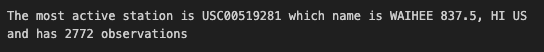
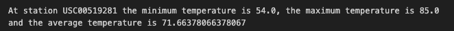
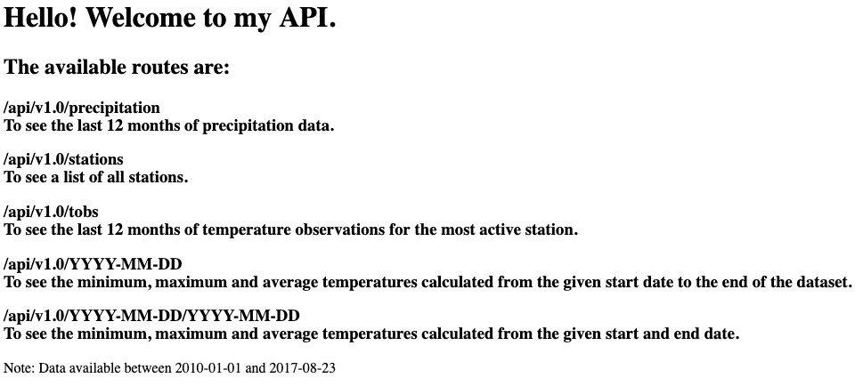
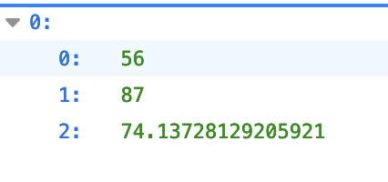
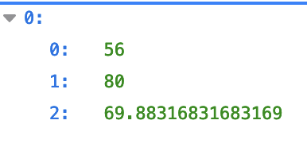

# sqlalchemy-challenge

Congratulations! You've decided to treat yourself to a long holiday vacation in Honolulu, Hawaii. To help with your trip planning, you decide to do a climate analysis about the area. The following sections outline the steps that you need to take to accomplish this task.

## Part 1: Analyze and Explore the Climate Data

### Precipitation Analysis

- Most recent date in the dataset.

- Date one year before the most recent date in data set.

- Pandas DataFrame with last 12 months of precipitation data.

- Chart showing last 12 months of precipiation data.

- Summary statistics for the last 12 months of precipitation data.

### Station Analysis

- Total number of stations in the dataset.

- Design a query to find the most-active stations (Use of Join)

- Which station id has the greatest number of observations?

- Design a query that calculates the lowest, highest, and average temperatures that filters on the most-active station id found in the previous query.

- Design a query to get the last 12 months of temperature observations (TOBS) for the most active station and plot a histogram with its results.

## Part 2: Design Your Climate App

Now that you’ve completed your initial analysis, you’ll design a Flask API based on the queries that you just developed.

- Landing Page (/)

- /api/v1.0/precipitation
Last 12 months of precipitation data presented as a JSON dictionary with "Date" as Key and the "Precipitation" results as a list of values.

- /api/v1.0/stations

List of stations presented as a JSON list.

- /api/v1.0/tobs

Last 12 months of temperature observations for the most active station presented as a JSON list of "Date" and "Temperature" lists.

- /api/v1.0/<start>

Minimum, average and maximum temperatures calculated from the given start date to the end of the dataset presented as a JSON list.

/api/v1.0/<start>/<end>

Minimum, average and maximum temperatures calculated from the given start and end dates presented as a JSON list

